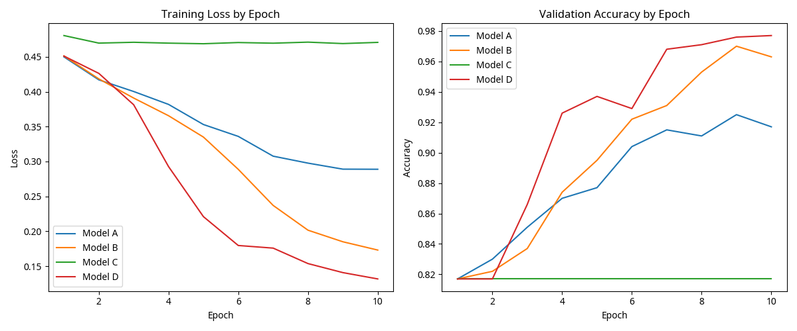

# CPE663 Major Assignment: Building a Mini Transformer and Producing a Small Benchmark

**Author:** Manus AI

## 1. Introduction

This assignment focuses on understanding the fundamental concepts of the Transformer architecture through practical implementation and experimentation. The primary objective is to build a compact Transformer model from first principles, train it on a synthetic sequence classification task, and conduct a comparative benchmark of various model configurations. The emphasis is on comprehending the internal workings of the Transformer rather than achieving state-of-the-art performance or optimizing for scale.

## 2. Method

### 2.1 Model Architecture

The implemented model is a mini Transformer encoder designed for binary sequence classification. It adheres to the core components of the Transformer architecture as outlined in the assignment, avoiding pre-built Transformer modules from libraries like `torch.nn.Transformer` or Hugging Face. The model pipeline is as follows:

1.  **Input Tokens**: Raw integer tokens representing the input sequence.
2.  **Token Embeddings**: Converts input tokens into dense vector representations.
3.  **Positional Encoding**: Adds positional information to the token embeddings, crucial for sequence understanding as Transformers lack inherent order awareness.
4.  **Transformer Encoder Blocks**: One or more stacked encoder blocks, each comprising Multi-Head Self-Attention and a Position-wise Feed-Forward Network, with residual connections and layer normalization.
5.  **Pooling**: After the encoder blocks, mean pooling is applied over the non-padding tokens to condense the sequence representation into a fixed-size vector.
6.  **Classification Head**: A linear layer that maps the pooled representation to a single outputlogit for binary classification.

### 2.2 Implemented Components

Each essential component of the Transformer encoder was implemented from scratch:

*   **Token Embedding**: `nn.Embedding` layer.
*   **Positional Encoding**: Sinusoidal positional encodings as described in the original Transformer paper [1].
*   **Scaled Dot-Product Attention**: Computes attention scores, scales them, applies a mask, and then a softmax to get attention weights.
*   **Multi-Head Self-Attention**: Extends scaled dot-product attention by running multiple attention mechanisms in parallel and concatenating their outputs.
*   **Position-wise Feed-Forward Network**: A two-layer feed-forward network with a ReLU activation in between.
*   **Residual Connections**: Add the input of a sub-layer to its output, followed by layer normalization.
*   **Layer Normalization**: Normalizes the inputs across the features.
*   **Transformer Encoder Block**: Combines multi-head self-attention and a position-wise feed-forward network with residual connections and layer normalization.
*   **Pooling**: Mean pooling over valid (non-padding) tokens.
*   **Classification Head**: A simple linear layer for binary output.
*   **Padding Mask Handling**: A mask is generated to prevent attention to padding tokens.

## 3. Experimental Setup

### 3.1 Dataset

The synthetic sequence classification dataset was generated according to the assignment specifications. Each sequence consists of discrete tokens (A, B, C, D, PAD) with true lengths between 6 and 20, padded to a maximum length of 20. The task is to predict whether the first non-padding token reappears in the second half of the non-padding portion of the sequence.

*   **Training Set**: 5000 samples
*   **Validation Set**: 1000 samples
*   **Test Set**: 1000 samples

### 3.2 Hyperparameters

The following hyperparameters were used for all model variants:

*   **Embedding Dimension**: 64
*   **Feed-Forward Dimension**: 128
*   **Dropout Rate**: 0.1
*   **Batch Size**: 32
*   **Learning Rate**: 0.001
*   **Epochs**: 10

### 3.3 Model Variants

Four model variants were benchmarked to explore the impact of positional encoding, number of attention heads, and number of layers:

| Alias   | Positional Encoding | Heads | Layers |
| :------ | :------------------ | :---- | :----- |
| Model A | Yes                 | 1     | 1      |
| Model B | Yes                 | 4     | 1      |
| Model C | No                  | 4     | 1      |
| Model D | Yes                 | 4     | 2      |

## 4. Results

### 4.1 Benchmark Table

The performance metrics for each model variant are summarized in the table below:

| Model   | Positional Encoding   |   Heads |   Layers |   Val Acc |   Test Acc |   Train Time (s) |   Parameters |
|:--------|:----------------------|--------:|---------:|----------:|-----------:|-----------------:|-------------:|
| Model A | Yes                   |       1 |        1 |     0.917 |      0.911 |            16.46 |        33985 |
| Model B | Yes                   |       4 |        1 |     0.963 |      0.956 |            19.28 |        33985 |
| Model C | No                    |       4 |        1 |     0.817 |      0.811 |            18.94 |        33985 |
| Model D | Yes                   |       4 |        2 |     0.977 |      0.97  |            32.42 |        67457 |

### 4.2 Training Curves

The training loss and validation accuracy curves across epochs for all model variants are presented in the figure below.

## 5. Discussion

### 5.1 Impact of Positional Encoding

Comparing Model B (with positional encoding) and Model C (without positional encoding), both having 4 heads and 1 layer, reveals a significant difference in performance. Model B achieved a validation accuracy of 0.963 and a test accuracy of 0.956, while Model C only reached 0.817 and 0.811 respectively. This clearly demonstrates the critical role of positional encoding in Transformer models for sequence-dependent tasks. Without explicit positional information, the model struggles to understand the order of tokens, leading to substantially lower accuracy.

### 5.2 Impact of Number of Attention Heads

Comparing Model A (1 head, 1 layer, with PE) and Model B (4 heads, 1 layer, with PE), both with similar parameter counts, shows that increasing the number of attention heads from 1 to 4 significantly improves performance. Model B achieved higher validation (0.963 vs 0.917) and test (0.956 vs 0.911) accuracies. This suggests that multiple attention heads allow the model to jointly attend to information from different representation subspaces at different positions, enriching its understanding of the input sequence.

### 5.3 Impact of Number of Layers

Comparing Model B (4 heads, 1 layer, with PE) and Model D (4 heads, 2 layers, with PE), Model D, with an additional encoder layer, achieved the highest validation (0.977) and test (0.970) accuracies. This improvement comes with an expected increase in training time (32.42s vs 19.28s) and parameter count (67457 vs 33985). The deeper architecture allows the model to learn more complex hierarchical representations, leading to better performance on the task.

### 5.4 Training Time and Parameter Count

As expected, models with more layers (e.g., Model D) exhibit longer training times and higher parameter counts. The increase in attention heads from 1 to 4 (Model A vs Model B) did not significantly increase training time or parameter count, indicating that the computational overhead of multiple heads is well-managed within the Transformer architecture for this scale.

## 6. Conclusion

This assignment successfully demonstrated the implementation of a mini Transformer encoder from scratch and its application to a synthetic sequence classification task. The benchmarking results highlight the importance of key Transformer components:

*   **Positional Encoding** is crucial for the model to understand token order in sequences.
*   **Multi-Head Attention** enhances the model's ability to capture diverse relationships within the input.
*   **Increased Depth (Layers)** allows for learning more complex representations, leading to improved accuracy at the cost of increased computational resources.

Overall, the exercise provided a comprehensive understanding of the Transformer architecture's building blocks and their individual contributions to model performance.

## 7. References

[1] Vaswani, A., Shazeer, N., Parmar, N., Uszkoreit, J., Jones, L., Gomez, A. N., Kaiser, Ł., & Polosukhin, I. (2017). *Attention Is All You Need*. arXiv.org. https://arxiv.org/abs/1706.03762
